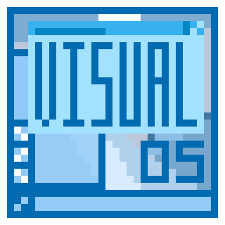

# VisualOS



VisualOS是一款游戏引擎,可以开发类似于系统一样的虚拟界面
本类库提供了一些前端系统UI和基础的窗体和游戏功能
开发者可以使用本类库进行更快的开发相关类型的游戏


## 如何使用

1. 通过 nuget 安装类库 [VisualOS](https://www.nuget.org/packages/VisualOS/)

```bash
Install-Package VisualOS
```

2. 调用 VisualOS

```c#
using VisualOS;
```

3. 传递主类和启动窗体,便可使用

```c#
//此处的Class 为你游戏需要的主类,方便你游戏其他窗口调用,如果无需可以填object,null
Class1 mc = new Class1();
MainWindows mw = new MainWindows<Class1>(mc);
mw.Header = "新 VisualOS 游戏";
winMessageBox.Show(mw,"欢迎使用VisualOS","欢迎,这是个文本框,只有个确定按钮")
mw.Show();
```

其他详细教程和说明参见 [Wiki文档](https://github.com/LorisYounger/VisualOS/wiki)

示例游戏参见 [虚拟主播模拟器-DEMO](https://github.com/LorisYounger/VUP-Simulater-Demo)

## 相关开发工具

本类库大量使用[PanuonWorkshop](https://github.com/PanuonInc/PanuonWorkshop), 因此推荐使用 PanuonWorkshop 进行游戏主题和窗体界面开发

通过[PanuonWorkshop](https://github.com/PanuonInc/PanuonWorkshop) , 可以进一步降低开发者对前端技术的要求,可以专心进行后端游戏性开发

参见文档 [<如何使用PanuonWorkshop制作VisualOS主题和窗体>](https://github.com/LorisYounger/VisualOS/wiki)

本类库也支持手动修改相应代码和创建其他窗体,不过使用[PanuonWorkshop](https://github.com/PanuonInc/PanuonWorkshop)将会更加方便些

## 开源/项目引用

* [LinePutScript](https://github.com/LorisYounger/LinePutScript) 一种数据交换格式定义行读取结构和描述其内容的标准语言
* [Panuon.UI.Silver](https://github.com/Panuon/Panuon.UI.Silver) 专业 WPF UI 美化类
